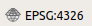

# Objectif 

Dans ce TD, vous allez apprendre à collecter des données spatiales provenant de différentes sources. Elles seront utiles pour réaliser le diagnostic de l'environnement naturel autour de votre exploitation agricole (cf. UE "Analyse et Diagnostic d'un agroécosystème"). Nous allons rassembler différentes données au niveau de la petite région agricole (PRA) ainsi qu'au niveau de l'exploitation elle-même (EA).

Pour cet exercice, l'exploitation agricole de Borret (ancien domaine de l'ENSAT) sera utilisée comme exemple. 

# Créer un nouveau projet QGIS

Nous allons enregistrer toutes les données dans un nouveau projet QGIS qui aura pour extension .qgz (format depuis la version 3).
Sous QGIS : `Projet > Nouveau`.

Par défaut, le Système de Coordonnées de Référence (SRC) d'un projet QGIS est celui du système de référence mondial WGS-84 (celui du système GPS), nom de code *EPSG:4326*. Le système de référence du projet est toujours affiché en bas à droite de la fenêtre de QGIS. Vous devriez avoir le SRC suivant : 

Les informations relatives à ce SRC sont accessibles depuis la barre d'état de QGIS ou dans le menu `Projet > Propriétés`.

Nous allons changer de SRC pour travailler dans le système de référence officiel de la France métropolitaine : la projection Lambert-93. Nom de code : *EPSG:2154*. Elle est liée au système géodésique RGF93. Les coordonnées sont définies en mètres. Si vous souhaitez en savoir plus sur la projection Lambert, reportez-vous à cette [page dédiée](https://fr.wikipedia.org/wiki/Projection_conique_conforme_de_Lambert).

- Dans l'onglet `SCR` de la fenêtre `Propriété du projet`, recherchez `2154` (code EPSG de la projection) via le filtre. Une fois la projection sélectionnée et le changement appliqué, vous pouvez vérifier qu'il est effectif dans la barre d'état du projet (en bas à droite de la fenêtre QGIS) :

- Dans l'onglet `Général` de la fenêtre `Propriété du projet`, donnez un nom (ex. TD_dataCollect). Il apparaîtra à côté du nom de la fenêtre QGIS.

Sauvegardez à présent votre projet dans votre dossier de travail : `Projet > Enregistrer sous...`

# Localiser votre EA

Nous allons représenter le siège de l'EA de Borret sous forme de point en utilisant le Geoportail de l'IGN.

**Méthode 1 : Export du lieu depuis le Geoportail**

L'IGN a conçu un portail de visualisation de nombreuses sources de données spatiales avec quelques fonctionnalités de localisation : [www.geoportail.gouv.fr/](https://www.geoportail.gouv.fr/)

Commencez par rechercher l'EA de Borret. Elle se trouve à Poucharramet en Haute Garonne. Choisissez les photographies aériennes comme fond de carte sur le Geoportail et repérez-vous par rapport à la photo ci-dessous.

{ width=50% }

Une fois que l'EA est localisée, sélectionnez l'onglet à droite de l'écran correspondant aux outils, puis `Annoter la carte` et placez votre point (siège de l'EA).

Votre point peut être exporté au format `kml` (depuis le menu `Annoter la carte`). Par défaut, le SRC associé aux objets est le WGS-84 (EPSG:4326). Après import sous QGIS, il faudra veiller à convertir le système pour être cohérent avec celui du projet (EPSG:2154). Nous le verrons par la suite lors de l'import.

