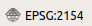

# Objectif 

Dans ce TD, vous allez apprendre à collecter des données spatiales provenant de différentes sources. Elles seront utiles pour réaliser le diagnostic de l'environnement naturel autour de votre exploitation agricole (cf. UE "Analyse et Diagnostic d'un agroécosystème"). Nous allons rassembler différentes données au niveau de la petite région agricole (PRA) ainsi qu'au niveau de l'exploitation elle-même (EA).

Pour cet exercice, l'exploitation agricole de Borret (ancien domaine de l'ENSAT) sera utilisée comme exemple. 

# Créer un nouveau projet QGIS

Nous allons enregistrer toutes les données dans un nouveau projet QGIS qui aura pour extension .qgz (format depuis la version 3).
Sous QGIS : `Projet > Nouveau`.

Par défaut, le Système de Coordonnées de Référence (SRC) d'un projet QGIS est celui du système de référence mondial WGS-84 (celui du système GPS), nom de code *EPSG:4326*. Le système de référence du projet est toujours affiché en bas à droite de la fenêtre de QGIS. Vous devriez avoir le SRC suivant : 

Les informations relatives à ce SRC sont accessibles depuis la barre d'état de QGIS ou dans le menu `Projet > Propriétés`.

Nous allons changer de SRC pour travailler dans le système de référence officiel de la France métropolitaine : la projection Lambert-93. Nom de code : *EPSG:2154*. Elle est liée au système géodésique RGF93. Les coordonnées sont définies en mètres. Si vous souhaitez en savoir plus sur la projection Lambert, reportez-vous à cette [page dédiée](https://fr.wikipedia.org/wiki/Projection_conique_conforme_de_Lambert).

- Dans l'onglet `SCR` de la fenêtre `Propriété du projet`, recherchez `2154` (code EPSG de la projection) via le filtre. Une fois la projection sélectionnée et le changement appliqué, vous pouvez vérifier qu'il est effectif dans la barre d'état du projet (en bas à droite de la fenêtre QGIS) :

- Dans l'onglet `Général` de la fenêtre `Propriété du projet`, donnez un nom (ex. TD_dataCollect). Il apparaîtra à côté du nom de la fenêtre QGIS.

Sauvegardez à présent votre projet dans votre dossier de travail : `Projet > Enregistrer sous...`

# Localiser votre EA

Nous allons représenter le siège de l'EA de Borret sous forme d'un point en s'aidant du Geoportail de l'IGN.

**Méthode 1 : Export du lieu depuis le Geoportail**

L'IGN a conçu un portail de visualisation de nombreuses sources de données spatiales avec quelques fonctionnalités de localisation : [www.geoportail.gouv.fr/](https://www.geoportail.gouv.fr/)

Commencez par rechercher l'EA de Borret. Elle se trouve à Poucharramet en Haute Garonne. Choisissez les photographies aériennes comme fond de carte sur le Geoportail et repérez-vous par rapport à la photo ci-dessous.

{ width=50% }

Une fois que l'EA est localisée, sélectionnez l'onglet à droite de l'écran correspondant aux outils, puis `Annoter la carte` et placez votre point (siège de l'EA).

Votre point peut être exporté au format `kml` (depuis le menu `Annoter la carte`). Par défaut, le SRC associé aux objets est le WGS-84 (EPSG:4326). Après import sous QGIS, il faudra veiller à convertir le système pour être cohérent avec celui du projet (EPSG:2154). Nous le verrons par la suite.

## Méthode 2 : import des coordonnées depuis un csv

Cette méthode ne requiert pas d'annoter la photographie aérienne sur le Geoportail. Elle consiste à lire les coordonnées du siège de l'EA et les enregistrer dans un fichier au format CSV (*comma-separated values*) qu'il sera possible d'importer sous QGIS. Le format CSV est très simple. Il correspond à un tableau décrit sous forme de texte : chaque ligne de texte correspond à une ligne du tableau et chaque virgule correspond au séparateur entre les colonnes. Vous pouvez le créer depuis un tableur (type Excel ou LibreOffice Calc) ou directement depuis un éditeur de texte (type notepad ou gedit). 

Pour obtenir les coordonnées X et Y du siège de l'EA, vous pouvez utiliser le Géoportail (onglet `outils > Afficher les cooronnées`). Plusieurs SRC sont proposés ce qui est intéressant. Cette source est très fiable. Une alternative est de passer par Google Maps. C'est ce que nous allons choisir ici pour l'exemple. 

Après avoir identifé l'EA sur Google Maps, cliquez (bouton droit) sur le lieu d'intérêt en sélectionnant ensuite l'option `Plus d'infos sur cet endroit` dans la fenêtre. Les coordonnées géographiques apparaissent en dégrés décimaux (EPSG:4326), dans l'ordre Y (latitude) et X (longitude). :warning: Cet ordre est une **source d'erreurs fréquentes** dans les imports...

{height=50px}

Enregistrez à présent les coordonnées via un tableur ou directement dans un éditeur de texte au format `csv`:

{height=50px}

## Importer le siège de l'EA sous QGIS

Pour importer un fichier, il faut passer par le `Gestionnaire des sources de données` :

{height=150px}

- Si vous avez opté pour la méthode 1, sélectionnez l'onglet `Vecteur` depuis le gestionnaire des couches et recherchez votre fichier `kml` comme source à importer (NB : le "glisser/déposer" peut aussi se pratiquer). 

- Si vous avez opté pour la méthode 2, sélectionnez l'onglet `Texte Délimité` et recherchez votre fichier `csv` comme nom à importer. 
:warning: Pensez à bien préciser la géométrie souhaitée. Il s'agit ici de créer un object ponctuel à partir des coordonnées (X,Y) enregistrées. Ainsi, il faut apparier vos colonnes du fichier avec les champs X et Y en choisissant une géométrie `point`. 
:warning: Ne pas oublier de préciser également dans quel SRC sont enregistrées vos coordonnées. Ici, le `SRC de la géométrie` a pour code EPSG:4326.

Une nouvelle couche contenant votre point est ajoutée au projet. Vous pouvez prendre connaissance de ses propriétés pour les contrôler (clic droit sur le nom de la couche > `Propriétés`). Dans l'onglet `Information`, vérifiez le SRC : `EPSG:4326`. Fermez ensuite la fenêtre. 

## Rendre cohérent le SRC de la couche avec celui du projet

Vérifiez le SRC de votre projet. A-t-il changé ? Il est probable qu'il soit repassé en WGS-84 (EPSG:4326) alors que nous l'avions défini en Lambert-93 (EPSG:2154)... Pourquoi ? Allez dans le menu `Préférences > Options` et sélectionnez l'onglet `SRC`. Par défaut, le SRC peut être (re)défini automatiquement lors de l'ajout de la première couche. Pour éviter cela, vous pouvez choisir le Lambert-93 comme SRC par défaut puis, fermer la fenêtre. Il faut ensuite redéfinir le SRC de votre projet (EPSG:2154).

{height=50px}

Ce n'est pas encore fini ! Le point importé est en WGS-84 alors que nous souhaitons travailler en Lambert-93 (SRC du projet). Le point est quand même visible malgré ses coordonnées car QGIS procède par défaut à une reprojection "à la volée" ce qui rend l'incohérence entre les SRC couche/projet transparente pour l'utilisateur (c'est bien dommage). Il faut donc procéder à une "reprojection" de la couche contenant l'EA pour la basculer dans le bon système de référence. Pour cela, allez dans le menu `Traitement > Boîte à outils` et recherchez l'algorithme `Reprojeter une couche`. NB : si le menu `Traitement` n'est pas accessible, allez dans `Extensions > Installer / Gérer les extensions` et activez l'extension `Processing`.

Le SCR cible de la nouvelle couche projetée doit être `EPSG:2154` comme celui de votre projet. Cette couche est à enregistrer dans le format [GeoPackage](https://www.geopackage.org/) (extension `gpkg`). Il s'agit d'un format récent, ouvert, et non propriétaire, implémenté sous forme d'une base de données SQLite. Une fois enregistrée, votre couche sera ajoutée dans QGIS. Vous pouvez alors supprimer les précédentes couches en WGS-84.

{height=100px}

