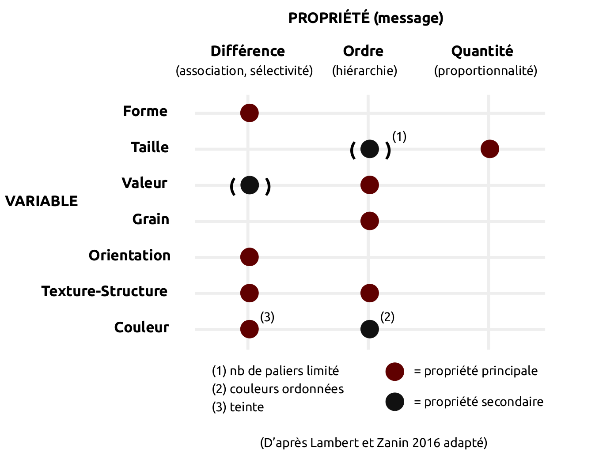

# Objectif

Dans ce TD, vous allez apprendre à représenter des données spatiales et réaliser des cartes thématiques en respectant les règles de sémiologie graphique. Ce TD fait suite au TD relatif à la collecte de données dont le contenu se trouve à l'adresse suivante : [https://github.com/dsheeren/1A_DATA-CEVI/tree/master/TD_1A_DATA-COLLECT](https://github.com/dsheeren/1A_DATA-CEVI/tree/master/TD_1A_DATA-COLLECT). Ces séances devraient vous aider à recueillir des données sur votre exploitation agricole (EA) et à les cartographier, pour enrichir le rapport de stage demandé dans l'UE "Analyse et Diagnostic d'un agroécosystème" (DA).


# Adapter la représentation au message cartographique

Une carte thématique permet de communiquer un message à l'aide d'un langage graphique. Le principe est de s'appuyer sur des signes graphiques (point, ligne, surface) que l'on fait varier de façon *proportionnelle*, *ordonnée* ou *différentielle* à l'aide de variables visuelles appropriées, afin de rendre perceptible le message. Les **règles de sémiologie graphique** garantissent la bonne adéquation entre la perception visuelle et le message souhaité.

On distingue 6 variables visuelles : la *forme*, la *taille*, la *valeur*, le *grain*, l'*orientation* et la *couleur*. Selon les auteurs, la texture-structure peut également être rajoutée. Chacune de ces variables a une ou plusieurs propriétés :





Avant de choisir une symbologie pour représenter la variable thématique d'intérêt, il faut donc s'interroger sur sa nature. S'agit-il d'une variable quantitative absolue ? quantitative relative ? qualitative nominale ? ordinale ? Pour davantage de détails sur ces aspects, reportez-vous au cours d'introduction à la collecte des données et à la cartographie thématique.


# Créer un nouveau projet QGIS

Nous allons enregistrer toutes les données dans un nouveau projet QGIS qui aura pour extension .qgz (format depuis la version 3). Sous QGIS : `Projet > Nouveau`.


## Choisir une projection adaptée

Par défaut, le Système de Coordonnées de Référence (SRC) d'un projet QGIS est celui du système de référence mondial WGS-84 (EPSG:4326). Le système de référence du projet est toujours affiché en bas à droite de la fenêtre de QGIS. Vous devriez avoir le SRC suivant :


Changez de SRC depuis les propriétés de votre projet : `Projet > Propriétés`. Dans l'onglet `SRC` (Système de Coordonnées de Référence), recherchez `2154`, soit le code EPSG de la projection Lambert-93. Une fois cette projection Lambert-93 validée, vous pouvez à nouveau vérifier le SRC du projet en bas à droite de la fenêtre de QGIS :


Dans l'onglet `Général`, donnez un nom à votre projet. Ensuite, sauvegardez-le dans votre dossier de travail qui contiendra également vos données vecteur/raster par la suite : `Projet > Enregistrer sous...`


# Représenter le parcellaire agricole

## Télécharger et importer les données

Les données utilisées pour ce TD sont disponibles à l'adresse suivante : [https://github.com/dsheeren/1A_DATA-CEVI/tree/master/TD_1A_DATA-VISU/data/data.zip](https://github.com/dsheeren/1A_DATA-CEVI/tree/master/TD_1A_DATA-VISU/data/data.zip). Le dossier contient un fichier vectoriel au format `.gpkg` qui représente un parcellaire fictif numérisé de l'exploitation agricole de Borret (fichier `parcelles_borret.gpkg`). Pour vous rappeler comment on peut construire ce parcellaire "à la main" par *digitalisation*, reportez-vous à la fin du TD sur la collecte des données (QGIS séance 2).

En plus du parcellaire agricole, 2 fichiers de type `.csv` sont fournis. Ils contiennent des données à relier aux parcelles :

 - `assolement_2018.csv` : il précise les cultures réalisées sur chacune des parcelles pour une saison culturale de 2018
 - `rendement.csv` : il informe sur le rendement moyen de chacune des cultures (en qt/ha)

Chargez la couche `parcelles_borret.gpkg` dans votre projet. Prenez connaissance du contenu de sa table attributaire (`clic droit sur la couche >` `ouvrir la table d'attributs`). Deux champs dans cette table sont présents : `fid` et `id_parcelle`.


## Afficher une étiquette

Affichez dans un premier temps l'identifiant de chaque parcelle sous la forme d'étiquette : `clic droit > Propriétés > Etiquettes`. N'hésitez pas à changer la police de l'étiquette ou d'autres propriétés, pour mieux faire ressortir l'identifiant.

Si vous souhaitez afficher un texte en plus de la valeur d'un champ, vous pouvez le faire à travers une **concaténation** de deux chaînes de caractères. Pour cela, calculez une nouvelle expression avec l'outil correspondant (bouton à droite de la valeur de l'étiquette). Insérez l'expression suivante :

```
concat('Parcelle n',"id_parcelle")
```

:warning: Remarquez la syntaxe différente selon qu'il s'agit d'un texte libre (guillemets *simples*) ou d'un texte correspondant à la valeur d'un champ (guillemets *double*) correspondant ici à `id_parcelle`.


{height=150px}


## Associer une couleur unique par parcelle


En vous aidant de l'identifiant unique de chaque parcelle (variable qualitative nominale), définissez depuis les `Propriétés` de la couche, onglet `Symbologie`, une palette de couleur afin que chaque parcelle soit représentée avec sa propre couleur. Quel type de symbologie faut-il appliquer ? Ici, le mode `Catégorisé` est le plus adapté en choissant le champ `id_parcelle` comme champ de Valeur.

{height=100px}

Demandez ensuite au logiciel de `Classer` les valeurs du champ (i.e. récupérer les différentes modalités du champ). Vous pouvez alors modifier la façon dont les parcelles seront représentées (clic double sur les carrés de la colonne `symbole`). Notez que pour les couleurs, il existe des palettes prédéfinies. Dans notre cas, c'est la teinte qu'il convient de modifier étant donner que nous cherchons à exprimer une différence (associativité, sélectivité). La palette de couleurs aléatoires est donc appropriée.

Le rendu peut prendre la forme suivante :

{height=210px}


## Améliorer le rendu

Pour améliorer la beauté de votre carte ;-), vous pouvez par exemple :

- ajouter de la transparence à la couleur de chaque parcelle,
- changer le ligne de contour du polygone,
- changer de police.
- choisir l'endroit où sera placé votre texte (`étiquette > position >` `forcer le point dans le polygone` par exemple)


# Habiller et exporter la carte du parcellaire agricole

Une fois votre symbologie fixée, vous pouvez créer une mise en page spécifique afin d'y ajouter les éléments essentiels de compréhension comme :

- un titre
- une légende
- la source des données
- l'auteur
- l'orientation
- la localisation sur un planisphère


Allez dans le menu `Projet > Nouvelle mise en page`. Pour ajouter vos données, cliquez sur l'icône `Ajouter une carte` dans le menu à gauche et cliquez ensuite sur la page.


Vous pouvez modifier la taille du bloc de la carte (emprise) pour l'adapter à la page. Pour déplacer les éléments au sein du bloc de carte, utilisez le bouton `Déplacer le contenu de l'objet` (flèche dans les 4 directions).

**Modifier l'échelle et l'emprise spatiale de votre carte**

Si l'échelle ou l'emprise spatiale de votre carte n'est pas satifaisante (trop grande ou trop petite) vous pouvez les modifier de plusieurs manières :

- soit **manuellement** en modifiant les paramètres `Échelle` (dans `Propriétés principales`) et `Emprise` ;
- soit **automatiquement** en *copiant* l'emprise ou l'échelle du canevas principale à l'aide des boutons  `Régler l'emprise de la carte pour qu'elle corresponde à l'emprise du canevas principal` et `Régler l'emprise de la carte pour qu'elle corresponde à l'emprise du canevas principal` (voir figure ci-dessous). Vous pouvez ainsi régler facilement l'emprise et l'échelle souhaitée sur la fenêtre principale de QGIS et ensuite la *copier*.


A présent, vous pouvez ajouter les différents éléments d'habillage que vous trouverez dans la barre d'outils `Boîte à outils`. Vous trouverez une illustration ci-dessous (même si la carte en elle-même présente peu d'intérêt ici) :


{height=330px}


Quand la carte vous convient, allez dans `Mise en page > Exporter au format PDF`, `image` ou `SVG` selon l'utilisation voulue.

N'oubliez pas de sauvegarder votre projet qui contiendra désormais votre première mise en page, félicitations !


# Ajouter l'assolement et la production de l'année 2018

Grâce au fichier `rendement.csv`, nous connaissons la rendement en quintaux/ha pour chaque type de culture.

Il faut donc désormais ajouter ces informations à notre fichier `parcelles.gpkg` pour pouvoir afficher les cultures et leur rendement. Mais pas question de le faire en les saisissant à la main !

Importez vos fichiers `.csv` directement dans QGIS (`Couche > Ajouter une couche >` `Ajouter une couche de texte délimité`). Sélectionnez votre fichier et cochez la case `Détecter les types de champs` pour que QGIS traite bien les nombres comme une colonne de type numérique et non de type texte. Ces fichiers `.csv` n'ont pas de géométrie (pas de coordonnées X et Y pour en générer). Il faudra donc aussi cocher l'option `Pas de géométrie` dans la partie `Définition de la géométrie`.

Prenez connaissance du contenu de la table attributaire comme pour toutes les couches importées sous QGIS (c'est un automatisme à acquérir).


## Joindre les tables

Pour lier des données entre elles, il faut d'abord identifier un champs (colonne) commun dans la table des parcelles et dans les fichiers importés. Ensuite, nous pourrons réaliser une *jointure* (attributaire ici) en se positionnant sur notre fichier de parcelles : `Clic droit > Propriété de la couche > Jointure`.

Une fois la colonne commune identifiée entre le fichier parcelle et le fichier `.csv`, appliquez la jointure. Ensuite, ouvrez la table attributaire du fichier `parcelles` et vérifiez qu'il contient bien une nouvelle colonne correctement remplie (l'assolement ou le rendement).

**ASTUCE :** ici, l'ordre des jointures est importante. Il faut d'abord joindre la table `assolement_2018` à la couche `parcelles_borret`. Vous pourrez constater qu'une colonne assolement (ou type) est maintenant présente dans la table attributaire de la couche `parcelles_borret`. Vous pouvez maintenant réaliser la deuxième jointure : joindre la table `rendement` à la couche `parcelles_borret`. Vous pourrez constater qu'une colonne rendement est maintenant présente dans la table attributaire de la couche `parcelles_borret`.


## Sauvegarder la jointure

Les jointures sont en fait un lien entre votre fichier vectoriel `.gpkg` et les fichiers `.csv`. Pour sauvegarder et ainsi figer la jointure, il est nécessaire d'exporter la couche : clic droit sur votre couche puis `Exporter > Sauvegarder les entités sous...`.


# Cartographier le rendement

Réalisez une carte *choroplèthe* qui représente sous la forme d'un aplat de couleur le rendement (en qt/ha). Pour cela, choisissez une symbologie en mode `Gradué`. Les valeurs de rendement seront discrétisées en un certain nombre de classes (seuils naturels de Jenks) et la palette de couleur impliquera une variation de la *valeur* pour une teinte choisie (ex. du vert clair au vert foncé). De cette façon, on perçoit visuellement un ordre entre les parcelles du point de vue de leur rendement (sachant que cette différence est uniquement liée ici au type de culture).


# Cartographier la production totale par parcelle

A présent, vous allez réaliser une nouvelle carte qui montre la production totale par parcelle. Connaissant le rendement de chaque culture, cette production totale peut être calculée en multipliant la valeur du rendement par la surface des parcelles.

Pour réaliser cette carte correctement, une représentation par symbole proportionnel à la production (variable quantitative absolue) est la plus appropriée. C'est en effet une variation de quantité qu'il convient de faire apparaître ici en jouant sur la *taille* des symboles. Nous allons également passer en mode d'implantation ponctuelle pour rendre la représentation indépendante de la surface des polygones.


## Créer un champ et calculer la production totale

Nous connaissons le rendement par type de culture. Nous allons créer un nouveau champ nommé 'production totale', `Clic droit > ouvrir la table d'attributs` puis :

- Ouvrir la calculatrice de champ (ctrl+i pour les geeks)
- Cocher `Créer un nouveau champ`
- Nom : 'prod_totale'
- Type : réel
- La formule à saisir est :

```
$area/10000 * "rendement"
```


:warning: Dans le cas présenté, la colonne contenant le rendement (production à l'hectare) par type de culture s'appelle *"rendement"*. Pensez à bien utiliser l'outil d'aide à la création d'expression pour retrouver le nom de votre colonne dans la partie `Champs et valeurs`.

`$area`, dans la partie `Géométrie`, représente une fonction qui permet de calculer la surface du polygone (en tenant compte de l'ellipsoïde), selon l'unité de mesure de la projection utilisée. Comme nous utilisons du Lambert-93 (EPSG:2154), l'unité est le mètre (ou mètre carré pour des surfaces). Donc, pour passer en hectares, nous divisons la surface en m2 par 10 000 que nous multiplions aussi par le rendement pour obtenir la production totale.


## Générer le centroïde des polygones

Une fois la production totale calculée, nous pouvons générer les centroïdes des polygones pour passer en mode d'implantation ponctuelle par la suite. Pour cela, dans la `boîte à outils de traitements`, recherchez le mot `centroïdes`, et générez-les (en pensant à bien enregister le fichier dans un endroit choisi avec un nom compréhensible...).


## Afficher le type de culture et la production en étiquette

Vous pouvez afficher plusieurs informations dans une étiquette comme le type d'assolement, sauter une ligne, et la production totale de la parcelle. Pour cela, on va concatener plusieurs chaînes de caractères en insérant un `\n` qui signifie un saut de ligne.

Dans l'étiquette, saisir l'expression suivante :
```
concat("assolement_2018_type",'\n', "prod_totale",'qt')
```

Pour vous familiariser avec l'outil, vous pouvez remplacer la production totale par la production à l'ha (soit le rendement) et afficher une étiquette sous la forme : `Maïs : 89qt/ha`. Rappelez-vous de la différence entre les simples et les doubles guillemets...


## Générer les cercles proportionnels

Cette étape permet de déterminer la taille d'un symbole en fonction de la valeur d'un champ. Dans notre cas, nous voulons faire varier la taille d'un cercle en fonction de la production totale de la parcelle.

Ouvrez la fenêtre `Symbologie` de la couche des centroïdes. Depuis le bouton à droite de la propriété `Taille`, utilisez l'`Assistant`.


Dans cette fenêtre, vous pouvez paramétrer la taille du symbole de façon proportionnelle à la valeur d'un champ. Dans notre cas, le champ `Source` à préciser est la production totale. Recalculer les valeurs min/max de ce champ à l'aide du bouton situé à droite. Arrondissez ensuite ces valeurs comme précisé dans l'illustration. A chacune de ces valeurs de production correspondent une taille pour le symbole de `Sortie` (avec méthode de calcul = surface). Les valeurs intermédiaires sont estimées par interpolation.


A présent, il faut générer la légende des cercles proportionnels. Pour cela, toujours dans la partie `Symbologie`, en bas à gauche, cliquez sur `Avancé > Légende définie par la` `taille des symboles`. Pour légender les symboles proportionnels, on utilise ce qu'on appelle une légende repliée.


Vous pouvez à nouveau faire une carte en combinant à la fois l'information ponctuelle (ici la production totale de la parcelle) avec le rendement selon le type de culture (exemple ci-dessous).


**ASTUCE** : Vous pourrez remarquer que la légende affichée dans votre composeur s'actualise en fonction des couches que vous affichez dans la fenêtre principale de QGIS. Ce peut être un comportement souhaitable, mais également indésirable.

Pour **supprimer un élément de la légende** vous pouvez :

- simplement décocher cet élement dans la fenêtre principale de QGIS ;
- Décocher la mis à jour automatique des `Élements de légende` dans les `propriétés de l'objet` (voir figure ci-dessous). Vous pourrez ensuite supprimer/ajouter des éléments de la légende.


## Ajouter une carte de localisation de la zone d'étude

Pour avoir un style différent de votre carte principale (celle des parcelles) il faudra faire des allers-retours entre le **composeur de mise en page** et la **fenêtre générale de QGIS**.

Dans **le composeur**, commencez par `Verrouiller les couches` de votre carte de principale (dans l'onglet `Propriétés de l'objet`). Ainsi, quand vous allez rajouter un fond de carte dans **le canevas principal de QGIS** , votre carte principale ne se mettra pas à jour et gardera uniquement l'ancienne configuration.

Maintenant que vous avez vérouillé votre carte principale, dans la **fenêtre générale de QGIS** (hors composeur de mise en page), ajoutez un fond de carte de type OpenStreetMap (OSM).

Dans le **composeur de mise en page**, ajoutez une petite carte (OSM) servant à localiser la zone d'étude sur votre carte principale. Il faut tout d'abord cliquer sur le bouton `Ajouter une nouvelle carte à la` `mise en page`, comme pour votre première carte (dans le composeur de mise en page).

Sélectionnez ensuite cette nouvelle carte puis, dans `Propriétés de` `l'objet`, allez dans la partie `Aperçu` et ajoutez comme cadre votre première carte (celle contenant vos parcelles).

Une fois paramétrées l'échelle et l'emprise de votre deuxième carte (celle de localisation), cochez l'option `Vérouiller les couches`.


# Générer un atlas

Un atlas permet de générer des cartes détaillées en utilisant un modèle identique. C'est par exemple utilisé pour préparer un document pour un relevé sur le terrain en montrant précisément chaque parcelle qui sera étudiée *in situ*.

L'objectif de l'atlas dans notre cas d'étude est de montrer pour chaque parcelle sa production totale et d'indiquer le type de culture.

Cliquez sur l'icône `Paramètres de l'atlas` du menu du composeur d'impression QGIS puis, cochez dans la fenêtre en bas à droite `Générer un atlas`. La couche de couverture est la couche pour laquelle chaque entité sera utilisée par QGIS pour générer chaque page de l'atlas. Nous choisirons ici les polygones des parcelles.

Cliquez ensuite sur votre carte avec l'outil `Sélectionner\Déplacer un objet` et dans `Propriété de l'objet` cochez `Controlée par Atlas`.

Une fois l'atlas créé, sélectionnez votre carte principale (et pas celle de la localisation), allez dans `Propriétés des objets` et cocher la partie `Contrôlé par l'atlas`. Vous pouvez désormais demander à générer votre atlas en cliquant sur le bouton `Aperçu de l'atlas`.

{height=60px}

Pour ajouter des valeurs (textuelles ou numériques) en fonction de votre parcelle (comme la production en qt), ajoutez un champ texte (icône texte sur la gauche), cochez la case `Rendu en html` puis cliquer sur `Insérer une expression...`.

Ainsi, il ne sera plus obligatoire d'utiliser la fonction `concat` car chaque variable sera mise entre crochets et entre %, comme par exemple :

```
En 2018, la parcelle n [% "id_parcelle" %] a produit

[% "prod_totale" %] qt de [% "assolement_2018_type" %]

```

Votre atlas sera donc composé de 10 cartes, dont l'une sera du style :


TODO : ajouter, enlever des élements de la légende
